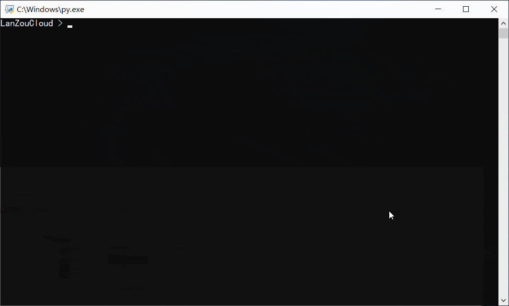
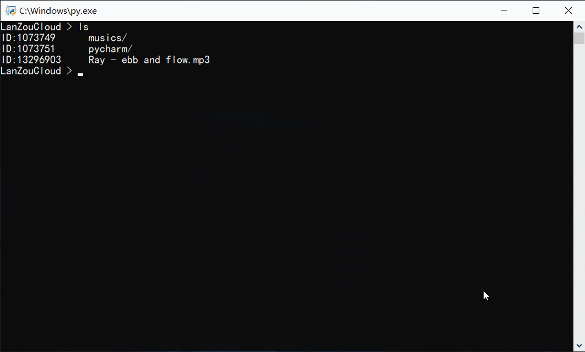
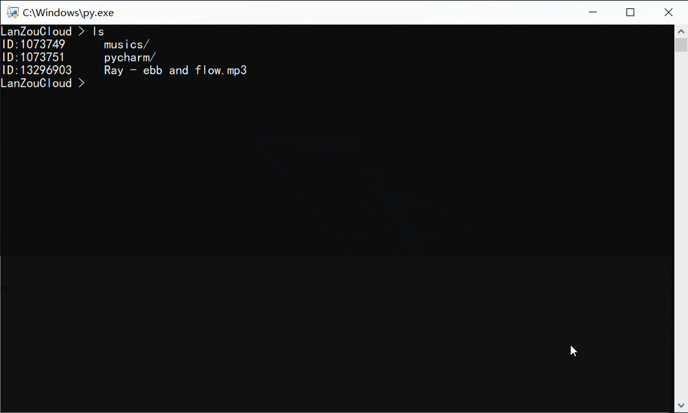
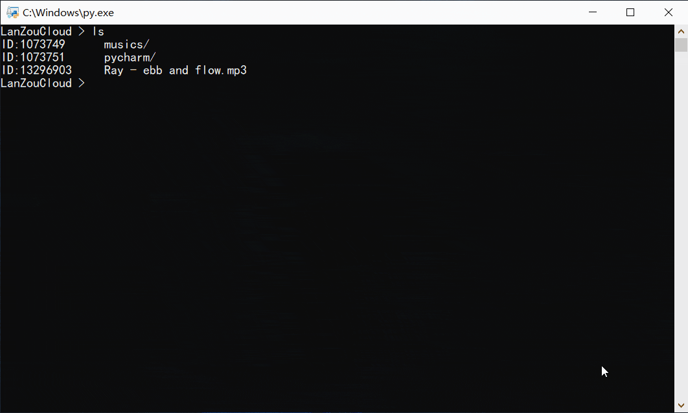

<h3 align="center">- 蓝奏云CMD -</h3>

# `v2.1` 更新说明
- 修复了蓝奏云分享链接格式变化导致无法获取直链的问题

# `v2.0`更新说明
- 修复了登录 `formhash` 的错误
- 增加了上传/下载的进度条 [#1](https://github.com/zaxtyson/LanZouCloud-CMD/issues/1)
- 使用 RAR 分卷压缩代替文件分段 [#2](https://github.com/zaxtyson/LanZouCloud-CMD/issues/2)
- 修复了连续上传大文件被ban的问题 [#3](https://github.com/zaxtyson/LanZouCloud-CMD/issues/3)
- 增加了回收站功能
- 取消了`种子文件`下载方式，自动识别分卷数据并解压
- 增加了通过分享链接下载的功能

# 下载使用
- 蓝奏云网盘下载 [Windows版](https://www.lanzous.com/b0f14h1od) 
- 在本项目的 [`releases`](https://github.com/zaxtyson/LanZouCloud-CMD/releases) 板块下载

# 其它说明
- 为了方便管理，API独立为一个项目[LanZouCloud-API](https://github.com/zaxtyson/LanZouCloud-API)
- 在 Linux 平台使用时，您需要安装 `rar` 工具，然后在 `config.ini`中设置它的路径
- 默认下载路径为 `D:\LanZouCloud`，请使用 `setpath` 命令修改
- 可以使用 `down 分享链接` 的方式下载文件(夹)了~
- 关注本页面以获取更新，如果有问题或者建议，请提 issue
- 如果喜欢本项目，请给一个 star (^▽^)/

# 命令帮助
    help    显示帮助信息
    login   登录网盘/切换账号
    logout  注销当前账号
    ls      列出文件(夹)
    cd      切换工作目录
    cdrec   进入回收站
    rm      删除网盘文件(夹)
    mkdir   创建新文件夹
    share   显示分享信息
    clear   清空屏幕
    clean   清空回收站
    upload  上传文件(夹)
    down    下载文件(夹)
    passwd  设置文件(夹)提取码
    setpath 设置默认下载路径
    rename  重命名文件夹
    mv      移动文件到某个文件夹
    bye     退出本程序
    
# 演示

> 批量上传文件/上传大文件

> 批量下载文件/分卷文件自动解压

> 获取分享链接/提取码/直链

> 通过分享链接下载文件(夹)

> 回收站恢复文件

> 其它功能自行探索~
